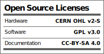

# Proton_Turbo_XT
Attempt to reverse-engineer a Proton PT8010AF based Turbo XT motherboard

## Introduction

This project is an attempt to reverse-engineer a Proton PT8010AF based Turbo XT motherboard. This work was in part done to confirm that Proton PT8010AF chipset is a clone of Faraday FE2010A.

## Schematic

[Schematic - Version 1.0](KiCad/Proton_Turbo_XT-Schematic-1.0.pdf)

## Red Tape

### Licensing

Proton Turbo XT is an open source hardware project. The hardware design itself, including schematic and PCB layout design files are licensed under the strongly-reciprocal variant of [CERN Open Hardware Licence version 2](license-cern_ohl_s_v2.txt). Documentation, including this file, is licensed under the [Creative Commons Attribution-ShareAlike 4.0 International License](license-cc-by-sa-4.0.txt).

